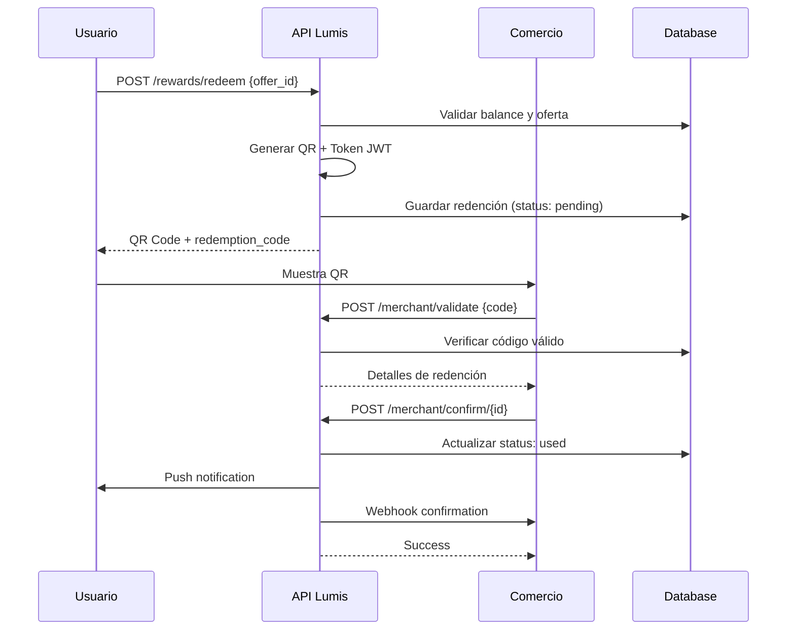

# 📱 API de Redención de Lumis - Documentación Completa

> **Versión:** 2.0  
> **Última actualización:** 10 de Diciembre, 2025  
> **Base URL:** `https://api.lumis.pa/api/v1`

---

## 📋 Índice

1. [Resumen del Sistema](#resumen-del-sistema)
2. [Flujo de Redención](#flujo-de-redención)
3. [Endpoints de Usuario](#endpoints-de-usuario)
4. [Endpoints de Comercio](#endpoints-de-comercio)
5. [Endpoints de Administración](#endpoints-de-administración)
6. [PWA Scanner para Comercios](#pwa-scanner-para-comercios)
7. [Modelos de Datos](#modelos-de-datos)
8. [Códigos de Error](#códigos-de-error)
9. [Rate Limiting](#rate-limiting)
10. [Webhooks](#webhooks)
11. [Seguridad](#seguridad)

---

## 🎯 Resumen del Sistema

El sistema de redención de Lumis permite a los usuarios canjear sus puntos (Lumis) por ofertas en comercios asociados. El flujo completo es:

```
Usuario redime oferta → Se genera QR con token JWT → Comercio escanea QR → 
Comercio valida código → Comercio confirma uso → Usuario recibe notificación
```

### Características Principales

| Característica | Descripción |
|----------------|-------------|
| **QR con Logo** | Códigos QR de 800x800px con logo Lum centrado (15%) |
| **Token JWT** | Validación criptográfica con expiración de 60 segundos |
| **Rate Limiting** | 10 redenciones/hora, 30/día por usuario (Redis) |
| **Notificaciones** | Push (FCM) al usuario + Webhook al comercio |
| **Expiración Automática** | Job cada hora expira códigos pendientes |
| **Ocultamiento** | Códigos usados/expirados se ocultan del usuario |

---

## 🔄 Flujo de Redención



---

## 👤 Endpoints de Usuario

### Autenticación
Todos los endpoints de usuario requieren header:
```
Authorization: Bearer <jwt_token>
```

---

### `GET /rewards/offers`
Lista ofertas disponibles para el usuario.

**Query Parameters:**
| Param | Tipo | Descripción |
|-------|------|-------------|
| `category` | string | Filtrar por categoría |
| `min_cost` | int | Costo mínimo en Lumis |
| `max_cost` | int | Costo máximo en Lumis |
| `merchant_id` | uuid | Filtrar por comercio |
| `sort` | string | `cost_asc`, `cost_desc`, `newest` |
| `limit` | int | Default: 20 |
| `offset` | int | Default: 0 |

**Response:**
```json
{
  "success": true,
  "data": {
    "offers": [
      {
        "offer_id": "550e8400-e29b-41d4-a716-446655440000",
        "name_friendly": "20% descuento en Pizza",
        "description_friendly": "Válido en cualquier pizza grande",
        "lumis_cost": 500,
        "category": "restaurantes",
        "merchant_name": "Pizza Hut",
        "image_url": "https://cdn.lumis.pa/offers/pizza.jpg",
        "is_available": true,
        "stock_remaining": 45,
        "max_redemptions_per_user": 3,
        "user_redemptions_count": 1,
        "expires_at": "2025-12-31T23:59:59Z"
      }
    ],
    "total": 150,
    "has_more": true
  }
}
```

---

### `GET /rewards/offers/:offer_id`
Detalle de una oferta específica.

**Response:**
```json
{
  "success": true,
  "data": {
    "offer": {
      "offer_id": "550e8400-e29b-41d4-a716-446655440000",
      "name": "PIZZA_20_OFF",
      "name_friendly": "20% descuento en Pizza",
      "description_friendly": "Válido en cualquier pizza grande. No acumulable con otras ofertas.",
      "lumis_cost": 500,
      "offer_category": "restaurantes",
      "merchant_id": "123e4567-e89b-12d3-a456-426614174000",
      "merchant_name": "Pizza Hut",
      "valid_from": "2025-01-01T00:00:00Z",
      "valid_to": "2025-12-31T23:59:59Z",
      "is_active": true,
      "stock_quantity": 45,
      "max_redemptions_per_user": 3,
      "img": "https://cdn.lumis.pa/offers/pizza.jpg",
      "terms_and_conditions": "Válido solo en restaurantes participantes..."
    },
    "user_can_redeem": true,
    "user_redemptions": 1,
    "user_balance": 2500
  }
}
```

---

### `POST /rewards/redeem`
Redimir una oferta (genera código QR).

**Request:**
```json
{
  "offer_id": "550e8400-e29b-41d4-a716-446655440000"
}
```

**Response (201 Created):**
```json
{
  "success": true,
  "data": {
    "redemption_id": "789e0123-e89b-12d3-a456-426614174000",
    "redemption_code": "LUMS-A1B2C3",
    "qr_code_base64": "data:image/png;base64,iVBORw0KGgo...",
    "qr_image_url": "https://api.lumis.pa/api/v1/rewards/qr/LUMS-A1B2C3.png",
    "qr_landing_url": "https://lumis.pa/redeem?code=LUMS-A1B2C3&token=eyJhbG...",
    "expires_at": "2025-12-11T10:30:00Z",
    "offer_name": "20% descuento en Pizza",
    "lumis_spent": 500,
    "new_balance": 2000,
    "status": "pending"
  }
}
```

**Errores posibles:**
| Código | Error | Descripción |
|--------|-------|-------------|
| 400 | `INSUFFICIENT_BALANCE` | No tiene suficientes Lumis |
| 400 | `OFFER_NOT_AVAILABLE` | Oferta inactiva o expirada |
| 400 | `OUT_OF_STOCK` | Sin stock disponible |
| 400 | `MAX_REDEMPTIONS_REACHED` | Límite por usuario alcanzado |
| 429 | `TOO_MANY_REQUESTS` | Rate limit excedido |

---

### `GET /rewards/history`
Lista las redenciones del usuario.

**Query Parameters:**
| Param | Tipo | Descripción |
|-------|------|-------------|
| `status` | string | `pending`, `used`, `expired`, `cancelled` |
| `limit` | int | Default: 20 |
| `offset` | int | Default: 0 |

**Response:**
```json
{
  "success": true,
  "data": {
    "redemptions": [
      {
        "redemption_id": "789e0123-e89b-12d3-a456-426614174000",
        "offer_name": "20% descuento en Pizza",
        "merchant_name": "Pizza Hut",
        "lumis_cost": 500,
        "status": "pending",
        "redemption_code": "LUMS-A1B2C3",
        "qr_landing_url": "https://lumis.pa/redeem?code=LUMS-A1B2C3&token=...",
        "qr_visible": true,
        "status_message": "Muestra este código en el comercio",
        "created_at": "2025-12-10T10:00:00Z",
        "expires_at": "2025-12-11T10:00:00Z",
        "used_at": null
      },
      {
        "redemption_id": "456e7890-e89b-12d3-a456-426614174000",
        "offer_name": "Café gratis",
        "merchant_name": "Starbucks",
        "lumis_cost": 200,
        "status": "used",
        "redemption_code": null,
        "qr_landing_url": null,
        "qr_visible": false,
        "status_message": "Usado el 09/12/2025 en Starbucks Multiplaza",
        "created_at": "2025-12-08T14:00:00Z",
        "expires_at": "2025-12-09T14:00:00Z",
        "used_at": "2025-12-09T11:30:00Z"
      }
    ],
    "total": 25
  }
}
```

> **Nota:** Los códigos `used` o `expired` tienen `qr_visible: false` y los campos sensibles (`redemption_code`, `qr_landing_url`) son `null` para evitar reutilización.

---

### `GET /rewards/history/:redemption_id`
Detalle de una redención específica.

---

### `DELETE /rewards/history/:redemption_id`
Cancelar una redención pendiente (devuelve Lumis).

**Response:**
```json
{
  "success": true,
  "data": {
    "message": "Redención cancelada exitosamente",
    "lumis_refunded": 500,
    "new_balance": 2500
  }
}
```

---

### `GET /rewards/stats`
Estadísticas de redención del usuario.

**Response:**
```json
{
  "success": true,
  "data": {
    "total_redemptions": 25,
    "total_lumis_redeemed": 12500,
    "pending_redemptions": 2,
    "used_redemptions": 20,
    "expired_redemptions": 3,
    "favorite_category": "restaurantes",
    "favorite_merchant": "Pizza Hut"
  }
}
```

---

## 🏪 Endpoints de Comercio

### Autenticación
Los endpoints de comercio requieren headers:
```
X-Merchant-Code: MERCHANT_CODE
X-Api-Key: api_key_secreto
```

---

### `POST /merchant/validate`
Validar un código de redención (sin marcarlo como usado).

**Request:**
```json
{
  "redemption_code": "LUMS-A1B2C3",
  "validation_token": "eyJhbGciOiJIUzI1NiIs..."
}
```

**Response:**
```json
{
  "success": true,
  "data": {
    "valid": true,
    "redemption_id": "789e0123-e89b-12d3-a456-426614174000",
    "redemption_code": "LUMS-A1B2C3",
    "offer_id": "550e8400-e29b-41d4-a716-446655440000",
    "offer_name": "20% descuento en Pizza",
    "lumis_cost": 500,
    "user_name": "Juan Pérez",
    "status": "pending",
    "expires_at": "2025-12-11T10:00:00Z",
    "can_confirm": true
  }
}
```

**Errores posibles:**
| Código | Error | Descripción |
|--------|-------|-------------|
| 400 | `INVALID_CODE` | Código no existe |
| 400 | `CODE_EXPIRED` | Código expirado |
| 400 | `CODE_ALREADY_USED` | Ya fue utilizado |
| 400 | `INVALID_TOKEN` | Token JWT inválido/expirado |
| 401 | `INVALID_CREDENTIALS` | Credenciales de comercio inválidas |

---

### `POST /merchant/confirm/:redemption_id`
Confirmar uso de una redención (marcar como usado).

**Response:**
```json
{
  "success": true,
  "data": {
    "message": "Redención confirmada exitosamente",
    "redemption_id": "789e0123-e89b-12d3-a456-426614174000",
    "redemption_code": "LUMS-A1B2C3",
    "confirmed_at": "2025-12-10T11:30:00Z",
    "offer_name": "20% descuento en Pizza",
    "lumis_value": 500
  }
}
```

**Errores posibles:**
| Código | Error | Descripción |
|--------|-------|-------------|
| 400 | `ALREADY_CONFIRMED` | Ya fue confirmado |
| 400 | `CODE_EXPIRED` | Código expirado |
| 404 | `NOT_FOUND` | Redención no encontrada |

---

### `GET /merchant/redemptions`
Lista redenciones del comercio.

**Query Parameters:**
| Param | Tipo | Descripción |
|-------|------|-------------|
| `status` | string | `pending`, `used`, `expired` |
| `date_from` | date | Fecha inicio (YYYY-MM-DD) |
| `date_to` | date | Fecha fin |
| `limit` | int | Default: 50 |
| `offset` | int | Default: 0 |

---

### `GET /merchant/analytics`
Estadísticas del comercio.

**Response:**
```json
{
  "success": true,
  "data": {
    "total_redemptions": 1250,
    "total_lumis_processed": 625000,
    "today_redemptions": 15,
    "this_week_redemptions": 89,
    "this_month_redemptions": 312,
    "average_redemption_value": 500,
    "top_offers": [
      {
        "offer_id": "550e8400-...",
        "offer_name": "20% descuento Pizza",
        "total_redemptions": 450
      }
    ],
    "redemptions_by_day": [
      {"date": "2025-12-09", "count": 45},
      {"date": "2025-12-10", "count": 38}
    ]
  }
}
```

---

## 👨‍💼 Endpoints de Administración

### Autenticación
Requiere JWT de usuario con rol admin (`ADMIN_USER_IDS` env var).

---

### `GET /rewards/admin/offers`
Lista todas las ofertas con estadísticas.

**Query Parameters:**
| Param | Tipo | Descripción |
|-------|------|-------------|
| `category` | string | Filtrar por categoría |
| `merchant_id` | uuid | Filtrar por comercio |
| `is_active` | bool | Solo activas/inactivas |
| `search` | string | Búsqueda por nombre |
| `sort_by` | string | `name`, `lumis_cost`, `created_at`, `total_redemptions` |
| `sort_order` | string | `ASC`, `DESC` |
| `limit` | int | Default: 20 |
| `offset` | int | Default: 0 |

**Response:**
```json
{
  "success": true,
  "data": {
    "offers": [
      {
        "offer_id": "550e8400-e29b-41d4-a716-446655440000",
        "name": "PIZZA_20_OFF",
        "name_friendly": "20% descuento en Pizza",
        "description_friendly": "Válido en cualquier pizza grande",
        "lumis_cost": 500,
        "offer_category": "restaurantes",
        "merchant_id": "123e4567-...",
        "merchant_name": "Pizza Hut",
        "stock_quantity": 45,
        "max_redemptions_per_user": 3,
        "valid_from": "2025-01-01T00:00:00Z",
        "valid_to": "2025-12-31T23:59:59Z",
        "is_active": true,
        "img": "https://cdn.lumis.pa/offers/pizza.jpg",
        "terms_and_conditions": "...",
        "created_at": "2025-01-01T00:00:00Z",
        "updated_at": "2025-06-15T14:30:00Z",
        "total_redemptions": 1250,
        "pending_redemptions": 12,
        "used_redemptions": 1200,
        "total_lumis_redeemed": 625000
      }
    ],
    "total": 45,
    "limit": 20,
    "offset": 0,
    "has_more": true
  }
}
```

---

### `GET /rewards/admin/offers/:offer_id`
Detalle de una oferta con estadísticas completas.

---

### `POST /rewards/admin/offers`
Crear nueva oferta.

**Request:**
```json
{
  "name": "COFFEE_FREE",
  "name_friendly": "Café Gratis",
  "description_friendly": "Un café americano o espresso gratis",
  "lumis_cost": 200,
  "offer_category": "cafeterias",
  "merchant_id": "123e4567-e89b-12d3-a456-426614174000",
  "merchant_name": "Starbucks",
  "stock_quantity": 500,
  "max_redemptions_per_user": 5,
  "valid_from": "2025-01-01T00:00:00Z",
  "valid_to": "2025-12-31T23:59:59Z",
  "img": "https://cdn.lumis.pa/offers/coffee.jpg",
  "terms_and_conditions": "Válido en todas las sucursales...",
  "is_active": true
}
```

**Response (201):** Retorna la oferta creada con estadísticas iniciales en 0.

---

### `PUT /rewards/admin/offers/:offer_id`
Actualizar oferta existente.

**Request:** Cualquier campo del modelo (parcial).
```json
{
  "lumis_cost": 250,
  "stock_quantity": 1000,
  "is_active": true
}
```

---

### `DELETE /rewards/admin/offers/:offer_id`
Soft delete (desactiva la oferta).

> ⚠️ **Protección:** No se puede eliminar si tiene redenciones pendientes.

**Response:**
```json
{
  "success": true,
  "data": {
    "message": "Oferta eliminada",
    "offer_id": "550e8400-..."
  }
}
```

---

### `POST /rewards/admin/offers/:offer_id/activate`
Activar una oferta desactivada.

---

### `POST /rewards/admin/offers/:offer_id/deactivate`
Desactivar una oferta activa.

---

## 📱 PWA Scanner para Comercios

### Acceso
```
https://api.lumis.pa/merchant-scanner/
```

### Características

| Feature | Descripción |
|---------|-------------|
| **Instalable** | PWA que se puede instalar en dispositivo móvil |
| **Offline** | Service Worker para funcionamiento básico offline |
| **Cámara** | Escaneo de QR usando cámara trasera |
| **Manual** | Input manual de código si cámara no funciona |
| **Historial** | Últimas 10 validaciones guardadas en localStorage |
| **Responsive** | Diseño optimizado para móviles |

### Flujo de Uso

1. **Login**
   - Ingresar código de comercio
   - Ingresar API Key
   - Credenciales guardadas en localStorage

2. **Escaneo**
   - Apuntar cámara al QR del cliente
   - O ingresar código manualmente (LUMS-XXXXXX)

3. **Validación**
   - Ver detalles de la redención
   - Confirmar nombre de oferta y cliente
   - Presionar "Confirmar Uso"

4. **Confirmación**
   - Toast de éxito
   - Se agrega al historial local

### Manifest
```json
{
  "name": "Lum Scanner",
  "short_name": "LumScan",
  "display": "standalone",
  "theme_color": "#6B46C1",
  "background_color": "#1a1a2e"
}
```

---

## 📦 Modelos de Datos

### RedemptionOffer
```typescript
interface RedemptionOffer {
  id: number;
  offer_id: UUID;
  name: string;
  name_friendly: string;
  description_friendly?: string;
  points?: number;           // Legacy
  lumis_cost: number;
  offer_category?: string;
  merchant_id?: UUID;
  merchant_name?: string;
  valid_from?: DateTime;
  valid_to?: DateTime;
  is_active: boolean;
  stock_quantity?: number;   // null = unlimited
  max_redemptions_per_user: number;
  img?: string;
  terms_and_conditions?: string;
  created_at: DateTime;
  updated_at: DateTime;
}
```

### UserRedemption
```typescript
interface UserRedemption {
  redemption_id: UUID;
  user_id: number;
  offer_id: UUID;
  lumis_cost: number;
  redemption_code: string;           // LUMS-XXXXXX
  validation_token_hash?: string;    // SHA256 del JWT
  qr_code_base64?: string;
  qr_image_url?: string;
  status: 'pending' | 'used' | 'expired' | 'cancelled';
  expires_at: DateTime;
  created_at: DateTime;
  used_at?: DateTime;
  confirmed_by_merchant_id?: UUID;
}
```

### Merchant
```typescript
interface Merchant {
  merchant_id: UUID;
  merchant_code: string;
  merchant_name: string;
  api_key_hash: string;
  webhook_url?: string;
  webhook_secret?: string;
  is_active: boolean;
  created_at: DateTime;
}
```

---

## ❌ Códigos de Error

### Errores de Usuario (4xx)
| Código | Error Code | Descripción |
|--------|------------|-------------|
| 400 | `BAD_REQUEST` | Request mal formado |
| 400 | `VALIDATION_ERROR` | Datos inválidos |
| 400 | `INSUFFICIENT_BALANCE` | Lumis insuficientes |
| 400 | `OFFER_NOT_AVAILABLE` | Oferta no disponible |
| 400 | `OUT_OF_STOCK` | Sin stock |
| 400 | `MAX_REDEMPTIONS_REACHED` | Límite alcanzado |
| 400 | `INVALID_CODE` | Código inválido |
| 400 | `CODE_EXPIRED` | Código expirado |
| 400 | `CODE_ALREADY_USED` | Código ya usado |
| 401 | `UNAUTHORIZED` | No autenticado |
| 401 | `INVALID_TOKEN` | Token inválido |
| 403 | `FORBIDDEN` | Sin permisos |
| 404 | `NOT_FOUND` | Recurso no encontrado |
| 429 | `TOO_MANY_REQUESTS` | Rate limit excedido |

### Errores de Servidor (5xx)
| Código | Error Code | Descripción |
|--------|------------|-------------|
| 500 | `INTERNAL_SERVER_ERROR` | Error interno |
| 500 | `DATABASE_ERROR` | Error de base de datos |
| 503 | `SERVICE_UNAVAILABLE` | Servicio no disponible |

### Formato de Error
```json
{
  "success": false,
  "data": null,
  "error": {
    "code": "INSUFFICIENT_BALANCE",
    "message": "No tienes suficientes Lumis. Necesitas 500, tienes 300.",
    "details": {
      "required": 500,
      "available": 300
    }
  },
  "request_id": "req_abc123"
}
```

---

## 🚦 Rate Limiting

### Límites por Usuario
| Período | Límite | Scope |
|---------|--------|-------|
| Por hora | 10 redenciones | Por user_id |
| Por día | 30 redenciones | Por user_id |

### Headers de Respuesta
```
X-RateLimit-Limit: 10
X-RateLimit-Remaining: 7
X-RateLimit-Reset: 1702209600
```

### Implementación
- Backend: Redis con `INCR` y `EXPIRE`
- Keys: `rate:redeem:hour:{user_id}`, `rate:redeem:day:{user_id}`
- TTL: 3600s (hora), 86400s (día)

### Error 429
```json
{
  "success": false,
  "error": {
    "code": "TOO_MANY_REQUESTS",
    "message": "Has superado el límite de redenciones. Intenta de nuevo en 45 minutos.",
    "details": {
      "retry_after": 2700
    }
  }
}
```

---

## 🔔 Webhooks

### Eventos
| Evento | Trigger |
|--------|---------|
| `redemption.created` | Usuario crea redención |
| `redemption.confirmed` | Comercio confirma uso |
| `redemption.expired` | Código expira automáticamente |
| `redemption.cancelled` | Usuario cancela redención |

### Payload
```json
{
  "event": "redemption.confirmed",
  "timestamp": "2025-12-10T11:30:00Z",
  "data": {
    "redemption_id": "789e0123-...",
    "redemption_code": "LUMS-A1B2C3",
    "offer_id": "550e8400-...",
    "offer_name": "20% descuento en Pizza",
    "user_id": 12345,
    "lumis_value": 500,
    "confirmed_at": "2025-12-10T11:30:00Z",
    "confirmed_by": "PIZZA_HUT_001"
  }
}
```

### Firma HMAC
```
X-Webhook-Signature: sha256=abc123...
```

Verificación:
```python
import hmac
expected = hmac.new(
    webhook_secret.encode(),
    payload.encode(),
    'sha256'
).hexdigest()
assert signature == f"sha256={expected}"
```

### Retry Policy
| Intento | Delay |
|---------|-------|
| 1 | Inmediato |
| 2 | 5 segundos |
| 3 | 30 segundos |
| 4 | 2 minutos |
| 5 | 10 minutos |

---

## 🔒 Seguridad

### Token JWT en QR
```json
{
  "redemption_code": "LUMS-A1B2C3",
  "user_id": 12345,
  "redemption_id": "789e0123-...",
  "exp": 1702209660,
  "jti": "unique-token-id"
}
```

- **Algoritmo:** HS256
- **Expiración:** 60 segundos
- **Secret:** `LUMIS_JWT_SECRET` env var
- **Hash almacenado:** SHA256 del token en DB

### Validación de QR
1. Extraer código y token de URL
2. Verificar firma JWT y expiración
3. Comparar hash del token con DB
4. Verificar estado `pending` y no expirado
5. Verificar que no fue usado previamente

### Protecciones Implementadas
- ✅ Rate limiting por usuario
- ✅ Token JWT con expiración corta
- ✅ Hash de token en DB (previene replay)
- ✅ Validación de merchant con API key hasheada
- ✅ HTTPS obligatorio
- ✅ CORS configurado
- ✅ Headers de seguridad (X-Content-Type-Options, etc.)

---

## 📊 Métricas Prometheus

### Métricas Disponibles
```
# Redenciones creadas
redemptions_created_total{category="restaurantes", success="true"}

# Redenciones confirmadas
redemptions_confirmed_total{merchant="PIZZA_HUT", offer="PIZZA_20_OFF"}

# Validaciones de comercio
merchant_validations_total{merchant="PIZZA_HUT", valid="true"}

# Latencia de redención
redemption_duration_seconds_bucket{le="0.5"}

# Códigos expirados
redemptions_expired_total
```

---

## 🗄️ Tablas de Base de Datos

### rewards.redemption_offers
```sql
CREATE TABLE rewards.redemption_offers (
    id SERIAL PRIMARY KEY,
    offer_id UUID DEFAULT gen_random_uuid() UNIQUE,
    name VARCHAR(255),
    name_friendly VARCHAR(255) NOT NULL,
    description_friendly TEXT,
    points INTEGER,
    lumis_cost INTEGER,
    offer_category VARCHAR(50),
    merchant_id UUID REFERENCES rewards.merchants(merchant_id),
    merchant_name VARCHAR(255),
    stock_quantity INTEGER,
    max_redemptions_per_user INTEGER DEFAULT 5,
    is_active BOOLEAN DEFAULT true,
    valid_from TIMESTAMPTZ DEFAULT NOW(),
    valid_to TIMESTAMPTZ,
    img TEXT,
    terms_and_conditions TEXT,
    created_at TIMESTAMPTZ DEFAULT NOW(),
    updated_at TIMESTAMPTZ DEFAULT NOW()
);
```

### rewards.user_redemptions
```sql
CREATE TABLE rewards.user_redemptions (
    redemption_id UUID PRIMARY KEY DEFAULT gen_random_uuid(),
    user_id BIGINT NOT NULL,
    offer_id UUID NOT NULL REFERENCES rewards.redemption_offers(offer_id),
    lumis_cost INTEGER NOT NULL,
    redemption_code VARCHAR(20) UNIQUE NOT NULL,
    validation_token_hash VARCHAR(64),
    qr_code_base64 TEXT,
    qr_image_url TEXT,
    status VARCHAR(20) DEFAULT 'pending',
    expires_at TIMESTAMPTZ NOT NULL,
    created_at TIMESTAMPTZ DEFAULT NOW(),
    used_at TIMESTAMPTZ,
    confirmed_by_merchant_id UUID REFERENCES rewards.merchants(merchant_id)
);

CREATE INDEX idx_redemptions_user ON rewards.user_redemptions(user_id);
CREATE INDEX idx_redemptions_code ON rewards.user_redemptions(redemption_code);
CREATE INDEX idx_redemptions_status ON rewards.user_redemptions(status, expires_at);
```

### rewards.merchants
```sql
CREATE TABLE rewards.merchants (
    merchant_id UUID PRIMARY KEY DEFAULT gen_random_uuid(),
    merchant_code VARCHAR(50) UNIQUE NOT NULL,
    merchant_name VARCHAR(255) NOT NULL,
    api_key_hash VARCHAR(64) NOT NULL,
    webhook_url TEXT,
    webhook_secret VARCHAR(64),
    is_active BOOLEAN DEFAULT true,
    created_at TIMESTAMPTZ DEFAULT NOW()
);
```

---

## 🧪 Tests Unitarios

### Tests Implementados

| Test | Descripción |
|------|-------------|
| `test_redemption_code_format` | Valida formato LUMS-XXXXXX |
| `test_qr_url_format` | Estructura de URL con token |
| `test_offer_exists_and_active` | Oferta activa existe |
| `test_offer_inactive_rejected` | Oferta inactiva rechazada |
| `test_offer_out_of_stock` | Sin stock disponible |
| `test_redemption_status_pending` | Estado inicial pending |
| `test_redemption_confirm_updates_status` | Confirmación cambia a used |
| `test_expired_redemption_not_confirmable` | Expiradas no confirmables |
| `test_prevent_double_confirmation` | Prevenir doble uso |
| `test_user_redemption_count` | Contador por usuario |
| `test_stock_decrement` | Decremento de stock |
| `test_expire_old_redemptions` | Job de expiración |
| `test_token_hash_consistency` | Hash SHA256 consistente |

### Ejecutar Tests
```bash
cargo test --test redemption_system_tests
```

---

## 📝 Changelog

### v2.0 (Diciembre 2025)
- ✅ QR con logo de Lum overlay (800x800px, 15% centro)
- ✅ Token JWT en URL del QR con expiración 60s
- ✅ Rate limiting Redis (10/hora, 30/día)
- ✅ Ocultamiento de códigos usados/expirados
- ✅ PWA Scanner para comercios
- ✅ API Admin CRUD completa
- ✅ Tests unitarios del sistema
- ✅ Webhook confirm arreglado (bug ownership)
- ✅ Endpoint estático para imágenes QR

### v1.0 (Octubre 2025)
- Sistema inicial de redención
- Generación básica de QR
- Validación y confirmación de comercios
- Notificaciones push y webhooks

---

## 🔗 Links Relacionados

- [Repositorio](https://github.com/andresv-qr/lum_rust_backend)
- [PWA Scanner](https://api.lumis.pa/merchant-scanner/)
- [Métricas Prometheus](https://api.lumis.pa/metrics)
- [Health Check](https://api.lumis.pa/health)

---

## 📁 Archivos Relacionados

### Backend Rust
| Archivo | Descripción |
|---------|-------------|
| `src/api/rewards/mod.rs` | Router principal de rewards |
| `src/api/rewards/offers.rs` | Endpoints de ofertas |
| `src/api/rewards/redeem.rs` | Endpoint de redención + rate limiting |
| `src/api/rewards/user.rs` | Endpoints de usuario (historial, stats) |
| `src/api/rewards/qr_static.rs` | Servir imágenes QR estáticas |
| `src/api/rewards/admin_offers.rs` | CRUD admin de ofertas |
| `src/api/merchant/validate.rs` | Validación y confirmación de comercio |
| `src/api/merchant/analytics.rs` | Estadísticas de comercio |
| `src/domains/rewards/models.rs` | Modelos de datos |
| `src/domains/rewards/redemption_service.rs` | Servicio de redención |
| `src/domains/rewards/offer_service.rs` | Servicio de ofertas |
| `src/domains/rewards/qr_generator.rs` | Generación de QR + JWT |

### PWA Scanner
| Archivo | Descripción |
|---------|-------------|
| `static/merchant-scanner/index.html` | Aplicación PWA |
| `static/merchant-scanner/manifest.json` | Manifest PWA |
| `static/merchant-scanner/sw.js` | Service Worker |
| `static/merchant-scanner/icons/` | Iconos de la app |

### Tests
| Archivo | Descripción |
|---------|-------------|
| `tests/redemption_system_tests.rs` | Tests unitarios completos |

### Assets
| Archivo | Descripción |
|---------|-------------|
| `assets/logoqr.png` | Logo para overlay en QR |
| `assets/qr/` | Carpeta de QRs generados |
