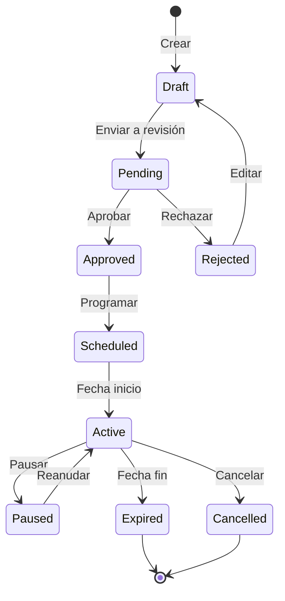

# 💼 Lógica de Negocio - Sistema de Ofertas

## 🎯 Reglas de Negocio Principales

### 1. Gestión de Lümis

#### Acumulación de Lümis
```yaml
Reglas:
  - Ratio base: 1 Lümi = $0.01 USD
  - Acumulación mínima: 10 Lümis por transacción
  - Acumulación máxima diaria: 10,000 Lümis por usuario
  - Bonus por primera compra: 2x Lümis
  - Bonus por referidos: 500 Lümis por referido activo
```

#### Validez de Lümis
```yaml
Políticas:
  - Lümis regulares: Expiran en 12 meses
  - Lümis promocionales: Expiran en 3 meses
  - Lümis de regalo: Expiran en 6 meses
  - FIFO: Se consumen primero los Lümis más antiguos
```

### 2. Gestión de Ofertas

#### Ciclo de Vida de una Oferta


#### Reglas de Publicación
```typescript
interface OfferPublishingRules {
  // Validaciones requeridas
  minDescription: 100; // caracteres
  maxDescription: 2000;
  minImages: 1;
  maxImages: 10;
  minValidityDays: 7;
  maxValidityDays: 365;
  
  // Restricciones por tipo de comercio
  maxActiveOffers: {
    basic: 5,
    premium: 20,
    enterprise: 'unlimited'
  };
  
  // Comisiones por tipo de oferta
  commissionRates: {
    discount: 0.10,      // 10%
    giftCard: 0.15,      // 15%
    cashback: 0.05,      // 5%
    raffle: 0.20,        // 20%
    experience: 0.25     // 25%
  };
}
```

### 3. Sistema de Redención

#### Flujo de Redención
```yaml
1. Validación Previa:
   - Usuario autenticado
   - Lümis suficientes
   - Oferta activa
   - Stock disponible
   - Límites no excedidos

2. Reserva:
   - Bloquear Lümis (5 minutos)
   - Reservar stock
   - Generar código único

3. Confirmación:
   - Debitar Lümis
   - Actualizar inventario
   - Generar QR
   - Notificar comercio

4. Validación en Comercio:
   - Escanear QR
   - Verificar código
   - Confirmar identidad
   - Marcar como usado

5. Post-Redención:
   - Solicitar review (24h después)
   - Calcular cashback si aplica
   - Actualizar métricas
```

#### Políticas de Cancelación
```yaml
Ventanas de Cancelación:
  - Gift Cards: No cancelable después de revelar código
  - Descuentos: 2 horas antes de expiración
  - Experiencias: 24 horas antes del evento
  - Sorteos: Hasta 1 hora antes del sorteo

Penalizaciones:
  - Primera cancelación: Sin penalización
  - 2-3 cancelaciones/mes: Advertencia
  - 4+ cancelaciones/mes: Suspensión temporal (7 días)
```

### 4. Control de Inventario

#### Gestión de Stock
```typescript
class InventoryManager {
  // Reglas de inventario
  rules = {
    lowStockThreshold: 0.20,  // 20% del stock inicial
    criticalStock: 10,         // unidades absolutas
    autoReplenish: {
      enabled: true,
      trigger: 0.10,           // 10% restante
      amount: 0.50             // reponer 50% del inicial
    }
  };
  
  // Algoritmo de reserva
  async reserveStock(offerId: string, quantity: number): Promise<Reservation> {
    // 1. Verificar disponibilidad
    // 2. Crear reserva temporal (5 min)
    // 3. Actualizar stock reservado
    // 4. Programar liberación automática
    return reservation;
  }
}
```

### 5. Sistema de Fraude y Seguridad

#### Detección de Patrones Sospechosos
```yaml
Red Flags:
  - Múltiples cuentas mismo dispositivo
  - Redenciones masivas en corto tiempo
  - Patrones de GPS inconsistentes
  - Velocidad imposible entre redenciones
  - IPs de VPN/Proxy conocidas

Acciones Automáticas:
  - Score < 70: Monitoreo
  - Score < 50: Verificación adicional
  - Score < 30: Bloqueo temporal
  - Score < 10: Suspensión de cuenta
```

#### Validación Multi-Factor
```typescript
interface ValidationLevels {
  low: {
    required: ['qrCode'],
    maxValue: 500  // Lümis
  },
  medium: {
    required: ['qrCode', 'pin'],
    maxValue: 2000
  },
  high: {
    required: ['qrCode', 'pin', 'biometric'],
    maxValue: 'unlimited'
  }
}
```

### 6. Gamificación y Engagement

#### Sistema de Niveles
```yaml
Niveles de Usuario:
  Bronce:
    - Requisito: 0 Lümis acumulados
    - Beneficios: Acceso básico
    
  Plata:
    - Requisito: 5,000 Lümis acumulados
    - Beneficios:
      - 5% descuento adicional
      - Acceso anticipado 1 hora
      
  Oro:
    - Requisito: 20,000 Lümis acumulados
    - Beneficios:
      - 10% descuento adicional
      - Acceso anticipado 24 horas
      - Ofertas exclusivas
      
  Platino:
    - Requisito: 50,000 Lümis acumulados
    - Beneficios:
      - 15% descuento adicional
      - Acceso VIP
      - Concierge service
      - Eventos exclusivos
```

#### Achievements y Badges
```typescript
const achievements = {
  firstRedemption: {
    name: "Primera Redención",
    reward: 100,
    icon: "🎉"
  },
  weeklyStreak: {
    name: "Racha Semanal",
    reward: 250,
    icon: "🔥"
  },
  bigSpender: {
    name: "Gran Gastador",
    condition: "10,000 Lümis en un mes",
    reward: 500,
    icon: "💎"
  },
  explorer: {
    name: "Explorador",
    condition: "10 comercios diferentes",
    reward: 300,
    icon: "🗺️"
  }
};
```

### 7. Algoritmos de Recomendación

#### Factores de Personalización
```python
def calculate_recommendation_score(user, offer):
    score = 0.0
    
    # Historial de categorías (40%)
    category_affinity = user.category_preferences.get(offer.category, 0)
    score += category_affinity * 0.4
    
    # Proximidad geográfica (20%)
    distance_score = 1.0 - (distance / MAX_DISTANCE)
    score += distance_score * 0.2
    
    # Popularidad general (15%)
    popularity = offer.redemption_count / MAX_REDEMPTIONS
    score += popularity * 0.15
    
    # Precio relativo a historial (15%)
    price_match = 1.0 - abs(offer.lumis - user.avg_spend) / user.avg_spend
    score += price_match * 0.15
    
    # Novedad (10%)
    days_since_launch = (now - offer.created_at).days
    novelty = max(0, 1.0 - days_since_launch / 30)
    score += novelty * 0.1
    
    return min(1.0, score)
```

### 8. Pricing y Revenue Management

#### Modelo de Precios Dinámicos
```yaml
Factores de Precio:
  Base:
    - Valor nominal del producto/servicio
    - Margen del comercio
    - Comisión plataforma
    
  Ajustes:
    Demanda Alta: +20%
    Demanda Baja: -15%
    Happy Hour: -30%
    Primera Compra: -10%
    Usuario Premium: -5%
    
  Restricciones:
    - Precio mínimo: Costo + 5%
    - Precio máximo: Valor mercado
    - Cambio máximo diario: 20%
```

#### Revenue Sharing
```typescript
interface RevenueDistribution {
  platform: {
    base: 0.15,           // 15% base
    premium: 0.12,        // 12% para comercios premium
    volume: {             // Descuentos por volumen
      '>1000': 0.10,
      '>5000': 0.08,
      '>10000': 0.05
    }
  },
  merchant: {
    min: 0.70,            // Mínimo 70%
    max: 0.95             // Máximo 95%
  },
  affiliate: 0.05         // 5% si hay referidor
}
```

### 9. Analytics y KPIs

#### Métricas Clave por Actor

##### Para Usuarios
```yaml
Métricas:
  - Lümis acumulados/mes
  - Tasa de redención
  - Ahorro total
  - Categorías favoritas
  - Frecuencia de uso
```

##### Para Comercios
```yaml
Dashboard Metrics:
  Conversión:
    - Views → Redemptions
    - Cost per Acquisition
    - ROI por campaña
    
  Engagement:
    - Usuarios únicos
    - Usuarios recurrentes
    - Tiempo promedio en oferta
    
  Revenue:
    - GMV generado
    - Ticket promedio
    - Incremento vs baseline
```

##### Para Plataforma
```yaml
Platform KPIs:
  Growth:
    - MAU (Monthly Active Users)
    - MRR (Monthly Recurring Revenue)
    - Churn Rate
    
  Health:
    - Liquidez (Lümis en circulación)
    - Velocity (Lümis/transacción)
    - Burn Rate
    
  Quality:
    - NPS Score
    - App Rating
    - Support Tickets/User
```

### 10. Compliance y Legal

#### GDPR/LGPD Compliance
```yaml
Data Handling:
  Retention:
    - Datos transaccionales: 5 años
    - Datos de navegación: 90 días
    - Datos de marketing: Hasta revocación
    
  User Rights:
    - Acceso a datos: 48 horas
    - Portabilidad: Formato JSON/CSV
    - Eliminación: 30 días (soft delete)
    - Rectificación: Inmediata
```

#### Anti-Money Laundering (AML)
```yaml
Controles AML:
  - KYC obligatorio > $500 USD/mes
  - Monitoreo transacciones > $1000 USD
  - Reporte autoridades > $10000 USD
  - Bloqueo países sancionados
```

### 11. Estrategias de Crecimiento

#### User Acquisition
```yaml
Canales:
  Orgánico:
    - SEO: Landing pages por categoría
    - ASO: Optimización app stores
    - Referrals: 500 Lümis por referido
    
  Pagado:
    - CAC Target: < $5 USD
    - LTV/CAC Ratio: > 3
    - Payback Period: < 6 meses
```

#### Retention Strategies
```yaml
Programas:
  Onboarding:
    - Tutorial interactivo: 100 Lümis
    - Primera redención: 200 Lümis bonus
    - Completar perfil: 50 Lümis
    
  Engagement:
    - Daily check-in: 10 Lümis
    - Weekly challenges
    - Seasonal events
    
  Win-back:
    - 7 días inactivo: Push notification
    - 14 días: Email con oferta
    - 30 días: Lümis bonus por volver
```

### 12. Integraciones Externas

#### Payment Gateways
```yaml
Proveedores:
  Stripe:
    - Gift cards internacionales
    - Procesamiento pagos
    
  PayPal:
    - Cashouts comercios
    - P2P transfers
    
  Crypto (Futuro):
    - Bridge Lümis ↔ Stablecoin
    - DeFi integrations
```

#### Third-Party Services
```yaml
Servicios:
  Twilio:
    - SMS validación
    - WhatsApp Business API
    
  SendGrid:
    - Email transaccional
    - Campañas marketing
    
  Google Maps:
    - Geolocalización
    - Rutas a comercios
    
  AWS Services:
    - S3: Almacenamiento imágenes
    - CloudFront: CDN
    - Rekognition: Validación documentos
```

## 📊 Matriz de Decisión

### Priorización de Features

| Feature | Impacto Usuario | Impacto Negocio | Esfuerzo | Prioridad |
|---------|----------------|-----------------|----------|-----------|
| QR Redemption | Alto | Alto | Medio | P0 |
| Gift Cards | Alto | Alto | Alto | P0 |
| Push Notifications | Alto | Medio | Bajo | P0 |
| Raffles | Medio | Alto | Medio | P1 |
| Social Sharing | Medio | Alto | Bajo | P1 |
| Gamification | Alto | Medio | Medio | P1 |
| AR Features | Bajo | Bajo | Alto | P3 |

---

*Última actualización: Diciembre 2024*
