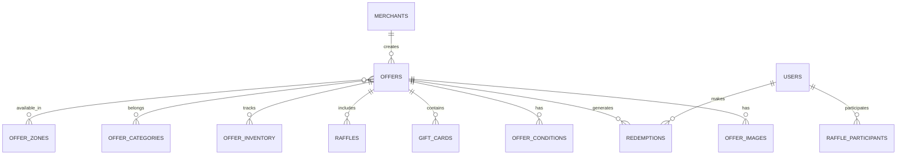

# 🗄️ Esquema de Base de Datos - Sistema de Ofertas

## 📊 Diagrama ER Simplificado



## 📋 Tablas del Esquema `offers`

### 1. Tabla: `merchants` (Comercios)

```sql
CREATE TABLE offers.merchants (
    id UUID PRIMARY KEY DEFAULT gen_random_uuid(),
    merchant_code VARCHAR(50) UNIQUE NOT NULL,
    business_name VARCHAR(200) NOT NULL,
    legal_name VARCHAR(200) NOT NULL,
    tax_id VARCHAR(50) UNIQUE NOT NULL,
    category VARCHAR(100) NOT NULL,
    subcategory VARCHAR(100),
    logo_url TEXT,
    banner_url TEXT,
    primary_color VARCHAR(7),
    secondary_color VARCHAR(7),
    
    -- Contacto
    email VARCHAR(255) NOT NULL,
    phone VARCHAR(20),
    website VARCHAR(255),
    
    -- Dirección principal
    address JSONB NOT NULL,
    coordinates POINT,
    
    -- Configuración
    commission_rate DECIMAL(5,2) DEFAULT 10.00,
    payment_terms INTEGER DEFAULT 30,
    auto_approve_offers BOOLEAN DEFAULT false,
    max_active_offers INTEGER DEFAULT 10,
    
    -- Estado
    status VARCHAR(20) DEFAULT 'pending',
    verified_at TIMESTAMP,
    verification_documents JSONB,
    
    -- Métricas
    total_offers_created INTEGER DEFAULT 0,
    total_redemptions INTEGER DEFAULT 0,
    average_rating DECIMAL(3,2),
    
    -- Metadata
    created_at TIMESTAMP DEFAULT CURRENT_TIMESTAMP,
    updated_at TIMESTAMP DEFAULT CURRENT_TIMESTAMP,
    created_by UUID,
    notes TEXT,
    
    CONSTRAINT check_status CHECK (status IN ('pending', 'active', 'suspended', 'inactive')),
    CONSTRAINT check_commission CHECK (commission_rate >= 0 AND commission_rate <= 100)
);

CREATE INDEX idx_merchants_status ON offers.merchants(status);
CREATE INDEX idx_merchants_category ON offers.merchants(category);
CREATE INDEX idx_merchants_coordinates ON offers.merchants USING GIST(coordinates);
```

### 2. Tabla: `offer_types` (Tipos de Ofertas)

```sql
CREATE TABLE offers.offer_types (
    id SERIAL PRIMARY KEY,
    code VARCHAR(50) UNIQUE NOT NULL,
    name VARCHAR(100) NOT NULL,
    description TEXT,
    icon VARCHAR(100),
    requires_inventory BOOLEAN DEFAULT false,
    requires_validation BOOLEAN DEFAULT true,
    allows_accumulation BOOLEAN DEFAULT false,
    min_lumis INTEGER DEFAULT 0,
    max_lumis INTEGER,
    configuration_schema JSONB,
    is_active BOOLEAN DEFAULT true,
    display_order INTEGER DEFAULT 0,
    created_at TIMESTAMP DEFAULT CURRENT_TIMESTAMP
);

-- Datos iniciales
INSERT INTO offers.offer_types (code, name, requires_inventory) VALUES
('gift_card', 'Gift Card', true),
('discount', 'Descuento', false),
('cashback', 'Cashback', false),
('raffle', 'Sorteo', true),
('donation', 'Donación', false),
('experience', 'Experiencia', true),
('bogo', '2x1 / 3x2', true),
('free_product', 'Producto Gratis', true),
('store_credit', 'Crédito en Tienda', false),
('upgrade', 'Upgrade de Servicio', true);
```

### 3. Tabla: `offers` (Ofertas Principales)

```sql
CREATE TABLE offers.offers (
    id UUID PRIMARY KEY DEFAULT gen_random_uuid(),
    merchant_id UUID NOT NULL REFERENCES offers.merchants(id),
    offer_type_id INTEGER NOT NULL REFERENCES offers.offer_types(id),
    
    -- Información básica
    title VARCHAR(200) NOT NULL,
    subtitle VARCHAR(300),
    description TEXT NOT NULL,
    short_description VARCHAR(500),
    tags TEXT[],
    
    -- Costos y valores
    lumis_cost INTEGER NOT NULL,
    original_price DECIMAL(10,2),
    discount_percentage DECIMAL(5,2),
    discount_amount DECIMAL(10,2),
    cashback_percentage DECIMAL(5,2),
    final_value DECIMAL(10,2),
    
    -- Vigencia
    start_date TIMESTAMP NOT NULL,
    end_date TIMESTAMP NOT NULL,
    availability_schedule JSONB,
    
    -- Restricciones
    min_purchase_amount DECIMAL(10,2),
    max_redemptions_per_user INTEGER DEFAULT 1,
    total_redemptions_limit INTEGER,
    daily_redemptions_limit INTEGER,
    requires_membership BOOLEAN DEFAULT false,
    membership_level INTEGER,
    
    -- Configuración específica por tipo
    configuration JSONB,
    
    -- Estado y aprobación
    status VARCHAR(20) DEFAULT 'draft',
    approval_status VARCHAR(20) DEFAULT 'pending',
    approved_by UUID,
    approved_at TIMESTAMP,
    rejection_reason TEXT,
    
    -- Prioridad y visibilidad
    priority INTEGER DEFAULT 0,
    is_featured BOOLEAN DEFAULT false,
    is_exclusive BOOLEAN DEFAULT false,
    visibility VARCHAR(20) DEFAULT 'public',
    
    -- Métricas
    view_count INTEGER DEFAULT 0,
    redemption_count INTEGER DEFAULT 0,
    save_count INTEGER DEFAULT 0,
    share_count INTEGER DEFAULT 0,
    
    -- SEO y búsqueda
    slug VARCHAR(255) UNIQUE,
    search_vector TSVECTOR,
    
    -- Metadata
    created_at TIMESTAMP DEFAULT CURRENT_TIMESTAMP,
    updated_at TIMESTAMP DEFAULT CURRENT_TIMESTAMP,
    published_at TIMESTAMP,
    
    CONSTRAINT check_dates CHECK (end_date > start_date),
    CONSTRAINT check_lumis CHECK (lumis_cost >= 0),
    CONSTRAINT check_status CHECK (status IN ('draft', 'scheduled', 'active', 'paused', 'expired', 'cancelled')),
    CONSTRAINT check_approval CHECK (approval_status IN ('pending', 'approved', 'rejected'))
);

CREATE INDEX idx_offers_merchant ON offers.offers(merchant_id);
CREATE INDEX idx_offers_type ON offers.offers(offer_type_id);
CREATE INDEX idx_offers_status ON offers.offers(status);
CREATE INDEX idx_offers_dates ON offers.offers(start_date, end_date);
CREATE INDEX idx_offers_search ON offers.offers USING GIN(search_vector);
CREATE INDEX idx_offers_tags ON offers.offers USING GIN(tags);
```

### 4. Tabla: `offer_images` (Imágenes de Ofertas)

```sql
CREATE TABLE offers.offer_images (
    id UUID PRIMARY KEY DEFAULT gen_random_uuid(),
    offer_id UUID NOT NULL REFERENCES offers.offers(id) ON DELETE CASCADE,
    image_url TEXT NOT NULL,
    thumbnail_url TEXT,
    image_type VARCHAR(20) DEFAULT 'gallery',
    display_order INTEGER DEFAULT 0,
    alt_text VARCHAR(255),
    width INTEGER,
    height INTEGER,
    size_bytes INTEGER,
    created_at TIMESTAMP DEFAULT CURRENT_TIMESTAMP,
    
    CONSTRAINT check_type CHECK (image_type IN ('main', 'gallery', 'thumbnail', 'banner'))
);

CREATE INDEX idx_offer_images_offer ON offers.offer_images(offer_id);
```

### 5. Tabla: `offer_conditions` (Términos y Condiciones)

```sql
CREATE TABLE offers.offer_conditions (
    id UUID PRIMARY KEY DEFAULT gen_random_uuid(),
    offer_id UUID NOT NULL REFERENCES offers.offers(id) ON DELETE CASCADE,
    condition_type VARCHAR(50) NOT NULL,
    title VARCHAR(200),
    description TEXT NOT NULL,
    display_order INTEGER DEFAULT 0,
    is_mandatory BOOLEAN DEFAULT true,
    created_at TIMESTAMP DEFAULT CURRENT_TIMESTAMP,
    
    CONSTRAINT check_type CHECK (condition_type IN ('terms', 'restrictions', 'instructions', 'legal', 'other'))
);

CREATE INDEX idx_conditions_offer ON offers.offer_conditions(offer_id);
```

### 6. Tabla: `offer_categories` (Categorías)

```sql
CREATE TABLE offers.offer_categories (
    id SERIAL PRIMARY KEY,
    parent_id INTEGER REFERENCES offers.offer_categories(id),
    code VARCHAR(50) UNIQUE NOT NULL,
    name VARCHAR(100) NOT NULL,
    description TEXT,
    icon VARCHAR(100),
    color VARCHAR(7),
    display_order INTEGER DEFAULT 0,
    is_active BOOLEAN DEFAULT true,
    created_at TIMESTAMP DEFAULT CURRENT_TIMESTAMP
);

-- Relación muchos a muchos
CREATE TABLE offers.offer_category_relations (
    offer_id UUID REFERENCES offers.offers(id) ON DELETE CASCADE,
    category_id INTEGER REFERENCES offers.offer_categories(id) ON DELETE CASCADE,
    PRIMARY KEY (offer_id, category_id)
);
```

### 7. Tabla: `offer_zones` (Zonas Geográficas)

```sql
CREATE TABLE offers.offer_zones (
    id SERIAL PRIMARY KEY,
    name VARCHAR(100) NOT NULL,
    type VARCHAR(20) NOT NULL,
    polygon GEOMETRY(POLYGON, 4326),
    center_point POINT,
    radius_km DECIMAL(6,2),
    parent_zone_id INTEGER REFERENCES offers.offer_zones(id),
    is_active BOOLEAN DEFAULT true,
    
    CONSTRAINT check_type CHECK (type IN ('country', 'state', 'city', 'district', 'custom'))
);

CREATE INDEX idx_zones_polygon ON offers.offer_zones USING GIST(polygon);

-- Relación con ofertas
CREATE TABLE offers.offer_zone_relations (
    offer_id UUID REFERENCES offers.offers(id) ON DELETE CASCADE,
    zone_id INTEGER REFERENCES offers.offer_zones(id),
    PRIMARY KEY (offer_id, zone_id)
);
```

### 8. Tabla: `offer_inventory` (Control de Inventario)

```sql
CREATE TABLE offers.offer_inventory (
    id UUID PRIMARY KEY DEFAULT gen_random_uuid(),
    offer_id UUID NOT NULL REFERENCES offers.offers(id) ON DELETE CASCADE,
    
    -- Cantidades
    initial_stock INTEGER NOT NULL,
    current_stock INTEGER NOT NULL,
    reserved_stock INTEGER DEFAULT 0,
    minimum_stock INTEGER DEFAULT 0,
    
    -- Control de reposición
    auto_replenish BOOLEAN DEFAULT false,
    replenish_amount INTEGER,
    replenish_trigger INTEGER,
    last_replenished_at TIMESTAMP,
    
    -- Alertas
    low_stock_alert BOOLEAN DEFAULT true,
    low_stock_threshold INTEGER DEFAULT 10,
    out_of_stock_at TIMESTAMP,
    
    -- Metadata
    created_at TIMESTAMP DEFAULT CURRENT_TIMESTAMP,
    updated_at TIMESTAMP DEFAULT CURRENT_TIMESTAMP,
    
    CONSTRAINT check_stock CHECK (current_stock >= 0),
    CONSTRAINT check_reserved CHECK (reserved_stock >= 0 AND reserved_stock <= current_stock)
);

CREATE UNIQUE INDEX idx_inventory_offer ON offers.offer_inventory(offer_id);
```

### 9. Tabla: `gift_cards` (Tarjetas de Regalo)

```sql
CREATE TABLE offers.gift_cards (
    id UUID PRIMARY KEY DEFAULT gen_random_uuid(),
    offer_id UUID REFERENCES offers.offers(id),
    
    -- Información del proveedor
    provider VARCHAR(100) NOT NULL,
    provider_product_id VARCHAR(100),
    
    -- Detalles
    denomination DECIMAL(10,2) NOT NULL,
    currency VARCHAR(3) DEFAULT 'USD',
    card_type VARCHAR(20) DEFAULT 'digital',
    delivery_method VARCHAR(20) DEFAULT 'email',
    
    -- Validez
    validity_months INTEGER DEFAULT 12,
    terms_url TEXT,
    
    -- Estado
    is_active BOOLEAN DEFAULT true,
    created_at TIMESTAMP DEFAULT CURRENT_TIMESTAMP,
    
    CONSTRAINT check_type CHECK (card_type IN ('digital', 'physical')),
    CONSTRAINT check_delivery CHECK (delivery_method IN ('email', 'sms', 'app', 'physical'))
);
```

### 10. Tabla: `raffles` (Sorteos)

```sql
CREATE TABLE offers.raffles (
    id UUID PRIMARY KEY DEFAULT gen_random_uuid(),
    offer_id UUID NOT NULL REFERENCES offers.offers(id),
    
    -- Configuración del sorteo
    ticket_price_lumis INTEGER NOT NULL,
    max_tickets_per_user INTEGER DEFAULT 10,
    total_tickets INTEGER NOT NULL,
    tickets_sold INTEGER DEFAULT 0,
    
    -- Premios
    prizes JSONB NOT NULL,
    total_winners INTEGER NOT NULL,
    
    -- Fechas
    draw_date TIMESTAMP NOT NULL,
    announcement_date TIMESTAMP,
    
    -- Resultado
    winning_numbers INTEGER[],
    draw_video_url TEXT,
    draw_certificate TEXT,
    
    -- Estado
    status VARCHAR(20) DEFAULT 'active',
    created_at TIMESTAMP DEFAULT CURRENT_TIMESTAMP,
    
    CONSTRAINT check_status CHECK (status IN ('active', 'sold_out', 'drawn', 'cancelled'))
);
```

### 11. Tabla: `raffle_participants` (Participantes de Sorteos)

```sql
CREATE TABLE offers.raffle_participants (
    id UUID PRIMARY KEY DEFAULT gen_random_uuid(),
    raffle_id UUID NOT NULL REFERENCES offers.raffles(id),
    user_id UUID NOT NULL,
    ticket_numbers INTEGER[] NOT NULL,
    tickets_count INTEGER NOT NULL,
    lumis_spent INTEGER NOT NULL,
    is_winner BOOLEAN DEFAULT false,
    prize_claimed BOOLEAN DEFAULT false,
    purchased_at TIMESTAMP DEFAULT CURRENT_TIMESTAMP,
    
    UNIQUE(raffle_id, user_id)
);

CREATE INDEX idx_participants_raffle ON offers.raffle_participants(raffle_id);
CREATE INDEX idx_participants_user ON offers.raffle_participants(user_id);
```

### 12. Tabla: `redemptions` (Redenciones)

```sql
CREATE TABLE offers.redemptions (
    id UUID PRIMARY KEY DEFAULT gen_random_uuid(),
    offer_id UUID NOT NULL REFERENCES offers.offers(id),
    user_id UUID NOT NULL,
    merchant_id UUID NOT NULL REFERENCES offers.merchants(id),
    
    -- Detalles de la redención
    redemption_code VARCHAR(20) UNIQUE NOT NULL,
    qr_code TEXT,
    lumis_spent INTEGER NOT NULL,
    savings_amount DECIMAL(10,2),
    
    -- Validación
    validation_method VARCHAR(20) NOT NULL,
    validated_at TIMESTAMP,
    validated_by UUID,
    validation_location POINT,
    validation_notes TEXT,
    
    -- Estado
    status VARCHAR(20) DEFAULT 'pending',
    expires_at TIMESTAMP NOT NULL,
    
    -- Para gift cards
    gift_card_code VARCHAR(100),
    gift_card_pin VARCHAR(20),
    
    -- Metadata
    device_info JSONB,
    ip_address INET,
    created_at TIMESTAMP DEFAULT CURRENT_TIMESTAMP,
    
    CONSTRAINT check_status CHECK (status IN ('pending', 'validated', 'used', 'expired', 'cancelled')),
    CONSTRAINT check_method CHECK (validation_method IN ('qr', 'code', 'nfc', 'manual'))
);

CREATE INDEX idx_redemptions_offer ON offers.redemptions(offer_id);
CREATE INDEX idx_redemptions_user ON offers.redemptions(user_id);
CREATE INDEX idx_redemptions_merchant ON offers.redemptions(merchant_id);
CREATE INDEX idx_redemptions_code ON offers.redemptions(redemption_code);
CREATE INDEX idx_redemptions_status ON offers.redemptions(status);
CREATE INDEX idx_redemptions_created ON offers.redemptions(created_at);
```

### 13. Tabla: `user_offer_interactions` (Interacciones de Usuario)

```sql
CREATE TABLE offers.user_offer_interactions (
    id UUID PRIMARY KEY DEFAULT gen_random_uuid(),
    user_id UUID NOT NULL,
    offer_id UUID NOT NULL REFERENCES offers.offers(id) ON DELETE CASCADE,
    interaction_type VARCHAR(20) NOT NULL,
    created_at TIMESTAMP DEFAULT CURRENT_TIMESTAMP,
    
    CONSTRAINT check_type CHECK (interaction_type IN ('view', 'save', 'share', 'report')),
    UNIQUE(user_id, offer_id, interaction_type)
);

CREATE INDEX idx_interactions_user ON offers.user_offer_interactions(user_id);
CREATE INDEX idx_interactions_offer ON offers.user_offer_interactions(offer_id);
```

### 14. Tabla: `offer_reviews` (Reseñas)

```sql
CREATE TABLE offers.offer_reviews (
    id UUID PRIMARY KEY DEFAULT gen_random_uuid(),
    offer_id UUID NOT NULL REFERENCES offers.offers(id),
    redemption_id UUID REFERENCES offers.redemptions(id),
    user_id UUID NOT NULL,
    rating INTEGER NOT NULL,
    title VARCHAR(200),
    comment TEXT,
    is_verified_purchase BOOLEAN DEFAULT false,
    helpful_count INTEGER DEFAULT 0,
    images TEXT[],
    merchant_response TEXT,
    merchant_response_at TIMESTAMP,
    status VARCHAR(20) DEFAULT 'pending',
    created_at TIMESTAMP DEFAULT CURRENT_TIMESTAMP,
    updated_at TIMESTAMP DEFAULT CURRENT_TIMESTAMP,
    
    CONSTRAINT check_rating CHECK (rating >= 1 AND rating <= 5),
    CONSTRAINT check_status CHECK (status IN ('pending', 'approved', 'rejected')),
    UNIQUE(offer_id, user_id)
);

CREATE INDEX idx_reviews_offer ON offers.offer_reviews(offer_id);
CREATE INDEX idx_reviews_user ON offers.offer_reviews(user_id);
CREATE INDEX idx_reviews_rating ON offers.offer_reviews(rating);
```

### 15. Tabla: `offer_analytics` (Analytics)

```sql
CREATE TABLE offers.offer_analytics (
    id UUID PRIMARY KEY DEFAULT gen_random_uuid(),
    offer_id UUID NOT NULL REFERENCES offers.offers(id),
    date DATE NOT NULL,
    
    -- Métricas de visualización
    impressions INTEGER DEFAULT 0,
    unique_views INTEGER DEFAULT 0,
    detail_views INTEGER DEFAULT 0,
    
    -- Métricas de engagement
    saves INTEGER DEFAULT 0,
    shares INTEGER DEFAULT 0,
    
    -- Métricas de conversión
    redemptions INTEGER DEFAULT 0,
    lumis_redeemed INTEGER DEFAULT 0,
    revenue_generated DECIMAL(10,2) DEFAULT 0,
    
    -- Métricas de usuarios
    new_users INTEGER DEFAULT 0,
    returning_users INTEGER DEFAULT 0,
    
    -- Tasas calculadas
    conversion_rate DECIMAL(5,2),
    average_lumis_per_redemption DECIMAL(10,2),
    
    created_at TIMESTAMP DEFAULT CURRENT_TIMESTAMP,
    
    UNIQUE(offer_id, date)
);

CREATE INDEX idx_analytics_offer ON offers.offer_analytics(offer_id);
CREATE INDEX idx_analytics_date ON offers.offer_analytics(date);
```

## 🔧 Funciones y Triggers

### Trigger para actualizar stock

```sql
CREATE OR REPLACE FUNCTION offers.update_inventory_stock()
RETURNS TRIGGER AS $$
BEGIN
    IF NEW.status = 'validated' AND OLD.status = 'pending' THEN
        UPDATE offers.offer_inventory
        SET current_stock = current_stock - 1,
            updated_at = CURRENT_TIMESTAMP
        WHERE offer_id = NEW.offer_id
        AND current_stock > 0;
        
        IF NOT FOUND THEN
            RAISE EXCEPTION 'No hay stock disponible';
        END IF;
    END IF;
    
    RETURN NEW;
END;
$$ LANGUAGE plpgsql;

CREATE TRIGGER trigger_update_stock
    BEFORE UPDATE ON offers.redemptions
    FOR EACH ROW
    EXECUTE FUNCTION offers.update_inventory_stock();
```

### Función para generar código de redención

```sql
CREATE OR REPLACE FUNCTION offers.generate_redemption_code()
RETURNS VARCHAR(20) AS $$
DECLARE
    chars TEXT := 'ABCDEFGHIJKLMNOPQRSTUVWXYZ0123456789';
    result VARCHAR(20) := '';
    i INTEGER;
BEGIN
    FOR i IN 1..20 LOOP
        result := result || substr(chars, floor(random() * length(chars) + 1)::int, 1);
    END LOOP;
    RETURN result;
END;
$$ LANGUAGE plpgsql;
```

### Vista materializada para ofertas populares

```sql
CREATE MATERIALIZED VIEW offers.popular_offers AS
SELECT 
    o.id,
    o.title,
    o.merchant_id,
    o.lumis_cost,
    o.status,
    COUNT(DISTINCT r.user_id) as unique_redeemers,
    COUNT(r.id) as total_redemptions,
    AVG(rev.rating) as average_rating,
    COUNT(DISTINCT rev.id) as review_count
FROM offers.offers o
LEFT JOIN offers.redemptions r ON o.id = r.offer_id
LEFT JOIN offers.offer_reviews rev ON o.id = rev.offer_id
WHERE o.status = 'active'
GROUP BY o.id
ORDER BY total_redemptions DESC, average_rating DESC NULLS LAST
LIMIT 100;

CREATE UNIQUE INDEX ON offers.popular_offers(id);

-- Refresh cada hora
CREATE OR REPLACE FUNCTION offers.refresh_popular_offers()
RETURNS void AS $$
BEGIN
    REFRESH MATERIALIZED VIEW CONCURRENTLY offers.popular_offers;
END;
$$ LANGUAGE plpgsql;
```

## 📊 Índices de Performance

```sql
-- Índices compuestos para queries frecuentes
CREATE INDEX idx_offers_active_dates ON offers.offers(status, start_date, end_date) 
    WHERE status = 'active';

CREATE INDEX idx_redemptions_user_status ON offers.redemptions(user_id, status, created_at);

CREATE INDEX idx_offers_merchant_active ON offers.offers(merchant_id, status) 
    WHERE status = 'active';

-- Índices parciales para mejorar performance
CREATE INDEX idx_offers_featured ON offers.offers(is_featured, priority DESC) 
    WHERE is_featured = true;

CREATE INDEX idx_inventory_low_stock ON offers.offer_inventory(offer_id) 
    WHERE current_stock < 10;
```

## 🔐 Row Level Security (RLS)

```sql
-- Habilitar RLS
ALTER TABLE offers.offers ENABLE ROW LEVEL SECURITY;
ALTER TABLE offers.redemptions ENABLE ROW LEVEL SECURITY;

-- Política para comercios
CREATE POLICY merchant_offers_policy ON offers.offers
    FOR ALL
    TO authenticated_merchant
    USING (merchant_id = current_setting('app.current_merchant_id')::UUID);

-- Política para usuarios
CREATE POLICY user_redemptions_policy ON offers.redemptions
    FOR SELECT
    TO authenticated_user
    USING (user_id = current_setting('app.current_user_id')::UUID);
```

## 🚀 Optimizaciones

### Particionamiento de tablas grandes

```sql
-- Particionar redemptions por mes
CREATE TABLE offers.redemptions_2024_12 PARTITION OF offers.redemptions
    FOR VALUES FROM ('2024-12-01') TO ('2025-01-01');

CREATE TABLE offers.redemptions_2025_01 PARTITION OF offers.redemptions
    FOR VALUES FROM ('2025-01-01') TO ('2025-02-01');
```

### Configuración de autovacuum

```sql
ALTER TABLE offers.offers SET (autovacuum_vacuum_scale_factor = 0.1);
ALTER TABLE offers.redemptions SET (autovacuum_vacuum_scale_factor = 0.05);
```

---

*Última actualización: Diciembre 2024*
