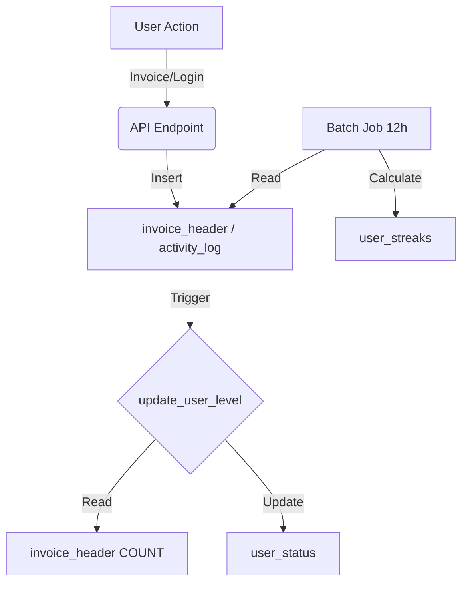

# 🎮 Gamification System Documentation (Optimized)

> **Version:** 2.0 (Optimized Schema)
> **Date:** November 30, 2025
> **Status:** Production Ready

---

## 1. Architecture Overview

The gamification system has been optimized from a complex 31-table schema to a high-performance **14-table architecture**. This design prioritizes:

1.  **Polymorphism:** Using `dim_mechanics` and `user_mechanics` with JSONB to handle Achievements, Missions, Events, and Combos in a single structure.
2.  **Performance:** Heavy reliance on Partial Indexes (e.g., `WHERE status = 'active'`) and a hybrid Trigger/Batch update strategy.
3.  **Simplicity:** Drastically reduced JOIN complexity for the Flutter frontend.

### Core Data Flow



---

## 2. Database Schema

### 2.1 Configuration Tables (The "Rules")

| Table | Description | Key Columns |
|-------|-------------|-------------|
| **`dim_mechanics`** | Unified config for all game elements. | `mechanic_id`, `type` (achievement, mission, event), `config` (JSONB), `reward_lumis` |
| **`dim_rewards`** | Catalog of available rewards. | `reward_id`, `lumis_amount`, `conditions` (JSONB) |
| **`teams`** | Team definitions. | `team_id`, `captain_user_id`, `team_config` (JSONB) |
| **`dim_user_levels`** | Level definitions. | `level_id`, `min_xp`, `max_xp`, `benefits_json` |

### 2.2 User State Tables (The "Progress")

| Table | Description | Key Columns |
|-------|-------------|-------------|
| **`user_status`** | **Central User Profile**. Includes Level, XP, and **Wallet Balance**. | `user_id`, `current_level_id`, `current_balance`, `current_xp` |
| **`user_mechanics`** | Tracks progress on all mechanics. | `user_id`, `mechanic_id`, `status` (active/completed), `progress` (JSONB) |
| **`user_streaks`** | Tracks consecutive behaviors. | `user_id`, `streak_type`, `current_count` |
| **`user_settings`** | User preferences. | `user_id`, `notification_prefs` (JSONB) |
| **`team_members`** | User-Team relationships. | `team_id`, `user_id`, `role` |

### 2.3 Transactional Tables (The "History")

| Table | Description | Key Columns |
|-------|-------------|-------------|
| **`point_ledger`** | Immutable ledger of all point transactions. | `tx_id`, `user_id`, `amount`, `source_type` |
| **`activity_log`** | Raw log of user actions for auditing/streaks. | `activity_id`, `user_id`, `activity_type`, `data` (JSONB) |
| **`leaderboard_cache`** | Pre-computed rankings. | `leaderboard_type`, `period`, `rankings_data` (JSONB) |

---

## 3. Key Logic & Functions

### 3.1 Level Updates (`update_user_level`)

The level calculation logic has been simplified to use `invoice_header` count as the source of truth for XP.

```sql
CREATE OR REPLACE FUNCTION gamification.update_user_level(p_user_id INTEGER)
RETURNS VOID AS $$
DECLARE
    v_total_invoices INTEGER;
    v_new_level INTEGER;
BEGIN
    -- 1. Count invoices (XP Source)
    SELECT COUNT(*) INTO v_total_invoices
    FROM public.invoice_header
    WHERE user_id = p_user_id;
    
    -- 2. Determine Level
    SELECT level_id INTO v_new_level
    FROM gamification.dim_user_levels
    WHERE v_total_invoices >= min_xp AND v_total_invoices <= max_xp
    LIMIT 1;
    
    -- 3. Update Status
    INSERT INTO gamification.user_status (...)
    VALUES (..., v_total_invoices, ...)
    ON CONFLICT (user_id) DO UPDATE ...;
END;
$$ LANGUAGE plpgsql;
```

### 3.2 Level Progression System (Lüm Universe)

The leveling system has been redesigned to reflect the "Lüm Universe" cosmology, with 17 levels divided into 5 tiers.

| Tier | Levels | Range (Invoices) | Theme |
|------|--------|------------------|-------|
| **1. Origen** | Chispa, Llama, Antorcha | 0 - 49 | Fire / Earth |
| **2. Atmósfera** | Viento, Nube, Tormenta | 50 - 149 | Air / Weather |
| **3. Espacio** | Luna, Planeta, Sol | 150 - 299 | Celestial Bodies |
| **4. Cosmos** | Cometa, Estrella, Nebulosa, Galaxia | 300 - 499 | Deep Space |
| **5. Lüm Universe** | Magio, Magio Supremo, Arquitecto, Omnisciente | 500+ | Ultimate Power |

### 3.3 Wallet Balance

The user's spendable balance is now stored in `gamification.user_status.current_balance`.
- **Source:** Originally migrated from `rewards.fact_balance_points`.
- **Updates:** Should be updated via transactional logic that writes to `point_ledger` and updates `user_status` atomically.

---

## 4. Views for Frontend

### `gamification.v_user_dashboard`

A single view provides 90% of the data needed for the Gamification Home Screen in Flutter.

**Columns:**
- `user_id`, `email`
- `total_invoices` (XP)
- `wallet_balance` (Lumis)
- `current_level`, `level_name`, `level_color`
- `level_min_points` - Minimum points required for the current level
- `level_max_points` - Maximum points for the current level (threshold to next level)
- `invoices_to_next_level`, `next_level_name`
- `active_streaks` (JSON Array)
- `active_mechanics_count`

> **Note:** Use `level_min_points` and `level_max_points` to calculate a progress bar within the current level:
> ```
> progress_percentage = (total_invoices - level_min_points) / (level_max_points - level_min_points) * 100
> ```

---

## 5. Migration Notes (From Legacy System)

- **Old Tables:** Renamed to `_backup_tablename`.
- **Achievements/Events:** Migrated to `dim_mechanics` with `mechanic_type` distinguishing them.
- **User Progress:** Consolidated into `user_mechanics`.
- **Balances:** Synced from `rewards.fact_balance_points`.

---

## 6. API Usage Examples

### Get User Dashboard
```sql
SELECT * FROM gamification.v_user_dashboard WHERE user_id = 123;
```

### Check Active Missions
```sql
SELECT m.mechanic_name, um.progress 
FROM gamification.user_mechanics um
JOIN gamification.dim_mechanics m ON um.mechanic_id = m.mechanic_id
WHERE um.user_id = 123 AND um.status = 'active' AND m.mechanic_type = 'mission';
```
